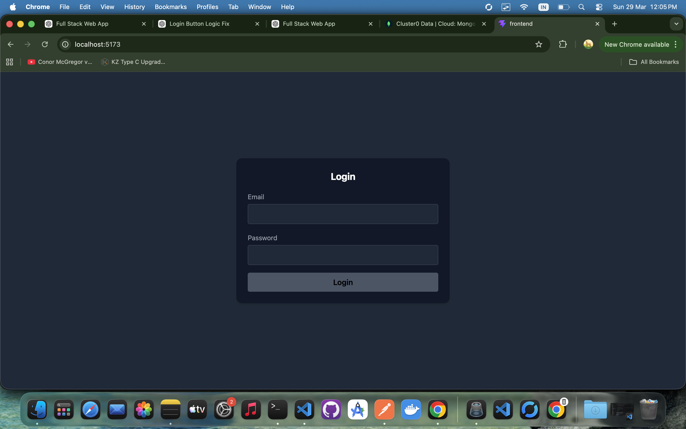
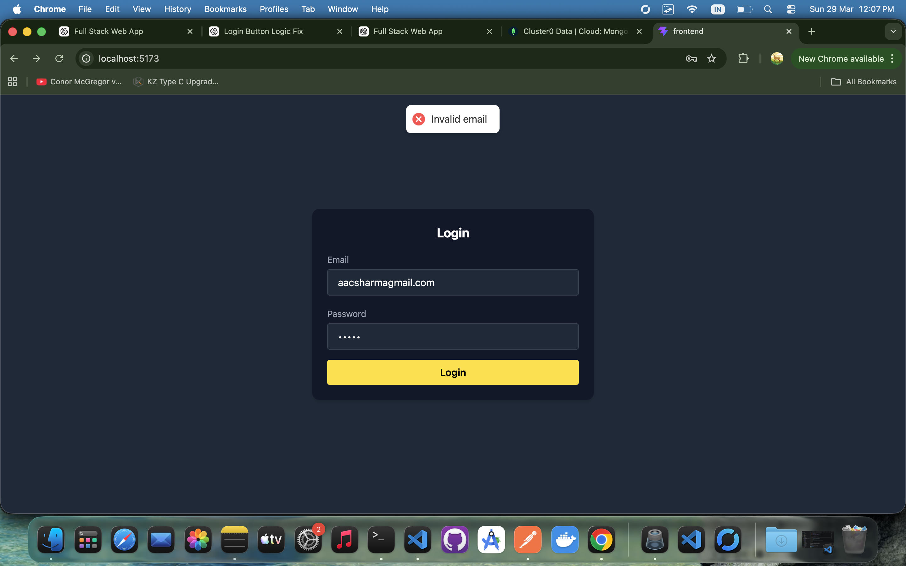
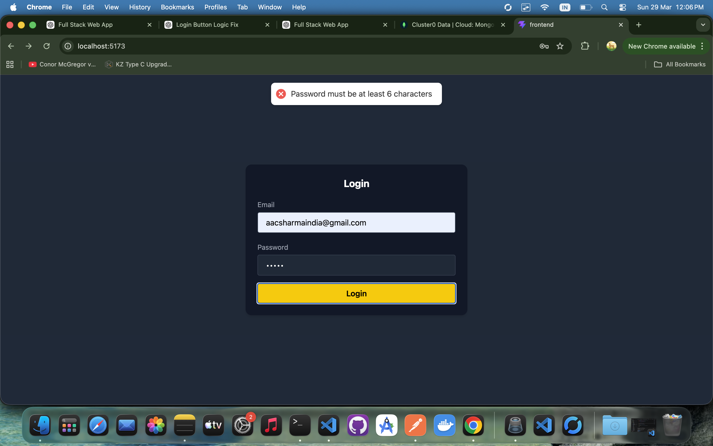
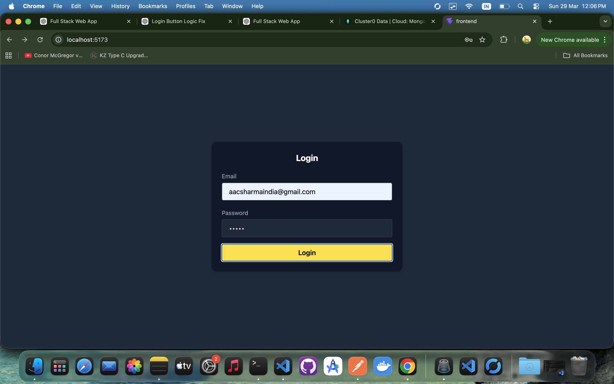
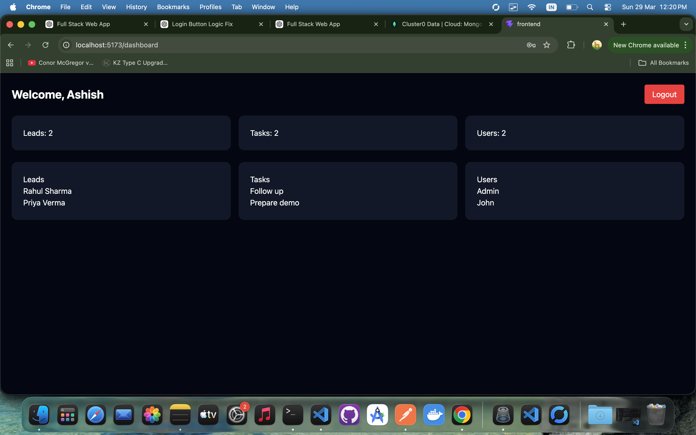

# 🚀 Demo app

## 📌 Overview

This is a simple full stack web application built as part of an assignment.
It demonstrates authentication, protected routes, and a basic dashboard UI.

---

Credentials
email : ashish@test.com
password: 123456

## 🛠️ Tech Stack

### Frontend

* React.js
* React Router
* Tailwind CSS
* Axios

### Backend

* Node.js
* Express.js
* MongoDB (Mongoose)
* JWT Authentication

---

## ✨ Features

* 🔐 User Login with JWT authentication
* 💾 Token stored in localStorage
* 🔒 Protected routes (Dashboard access only after login)
* 👤 Fetch authenticated user data (`/user/me`)
* 📊 Simple Dashboard with dummy data (Leads, Tasks, Users)
* 🚪 Logout functionality

---

## 📁 Project Structure

```
client/
  ├── components/
  ├── context/
  ├── pages/
  ├── services/
  └── App.js

server/
  ├── controllers/
  ├── models/
  ├── routes/
  └── server.js
```

---

## ⚙️ Setup Instructions

### 1️⃣ Clone the repository

```
git clone https://github.com/Sharma4ashish/Demo-App
cd project-folder
```

---

### 2️⃣ Setup Backend

```
cd backend
npm install
```
alredy have my env details 
npm run dev
```

---

### 3️⃣ Setup Frontend

```
cd frontend
npm install
npm run dev
```

## 📸 Screenshots

### 🔐 Login Page


### ❌ Invalid Input Validation


### 🔒 Password Validation


### ✅ Active Button After Input



### 📊 Dashboard


---

## 🔑 Authentication Flow

1. User logs in with email & password
2. Backend returns a JWT token
3. Token is stored in `localStorage`
4. For protected routes, token is sent in headers:

   ```
   Authorization: Bearer <token>
   ```
5. Backend verifies token and returns user data

---

## 🧪 API Endpoints

### Auth

* `POST /user/login` → Login user

### User

* `GET /user/me` → Get current user (Protected)

---

## 📌 Notes
* Minimal AuthContext is used for managing user state
* Dashboard data is currently static (for demo purposes)

## 👨‍💻 Author

Ashish Sharma
Full Stack Developer (Node.js + React)

---
